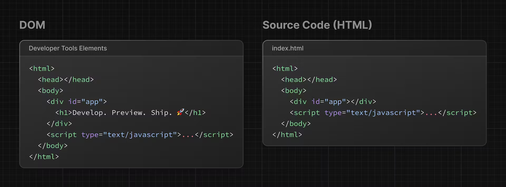

# What if we only use javascript only

## Aims

In this article you will get this information:

1. How to create a page without React (only HTML and Javascript)
2. Javascript problem and hard to maintain the code
3. Too much boiler plate

## Step to produce

1. Create index.html

```html
<html>
  <body>
    <div></div>
  </body>
</html>
```

2. Give the unique ID so you can target it later inside your JS file

```html
<html>
  <body>
    <div id="app"></div>
  </body>
</html>
```

3. To write JavaScript inside your HTML file, add a script tag:

```html
<html>
  <body>
    <div id="app"></div>
    <script type="text/javascript"></script>
  </body>
</html>
```

4. use DOM method getElementById() to select the <div> element by its ID:

```html
<html>
  <body>
    <div id="app"></div>
    <script type="text/javascript">
      const app = document.getElementById('app');
    </script>
  </body>
</html>
```

5. You can continue using DOM method to create a new <h1> element

```html
<html>
  <body>
    <div id="app"></div>
    <script type="text/javascript">
      // Select the div element with 'app' id
      const app = document.getElementById('app');

      // Create a new H1 element
      const header = document.createElement('h1');

      // Create a new text node for the H1 element
      const text = 'Develop. Preview. Ship.';
      const headerContent = document.createTextNode(text);

      // Append the text to the H1 element
      header.appendChild(headerContent);

      // Place the H1 element inside the div
      app.appendChild(header);
    </script>
  </body>
</html>
```

To make sure everything is working, open your HTML file inside your browser of choice. You should see an h1 tag that says, 'Develop. Preview. Ship.'.

## HTML vs DOM

If you look at the DOM elements inside your browser developer tools, you will notice the DOM includes the <h1> element. The DOM of the page is different from the source code - or in other words, the original HTML file you created.



> This is because the HTML represents the initial page content, whereas the DOM represents the updated page content which was changed by the JavaScript code you wrote.

## Key take away

Updating the DOM with plain JavaScript is very powerful but verbose. You've written all this code to add an <h1> element with some text:

```js
<script type="text/javascript">
  const app = document.getElementById('app'); const header =
  document.createElement('h1'); const text = 'Develop. Preview. Ship.'; const
  headerContent = document.createTextNode(text);
  header.appendChild(headerContent); app.appendChild(header);
</script>
```

As the size of an app or team grows, it can become increasingly challenging to build applications this way.

> We have been writing code as an imperative way (We give an instruction step-by-step) i can gives an analogy like you are a chef that creating pizza. With react we will use declarative programming. Instead we give an instruction, we just tell program what we need to create, this is like you ordering pizza (not creating pizza anymore just say it what do you want).
