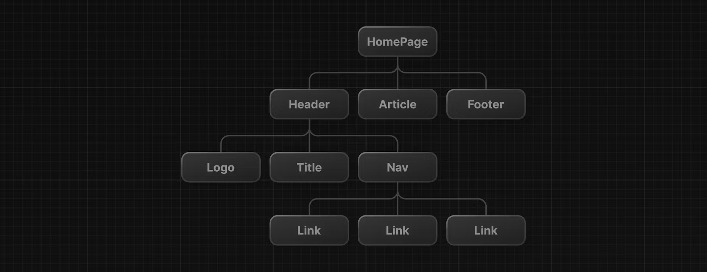

# React core concepts

There are three core concepts of React that you'll need to be familiar with to start building React applications. These are:

- Components
- Props
- State

We only need to know these concept. Other things we can learn when we build the application.

## Components

User interfaces can be broken down into smaller building blocks **called components**.

You can think your code as LEGO bricks.

You can take these individual bricks and combine them together to form larger stucture.


> This modularity allows your code to be more maintainable as it grows because you can add, update, and delete components without touching the rest of our application.

```html index.html
<script type="text/jsx">
  const app = document.getElementById("app")

  function header() {
  }

  const root = ReactDOM.createRoot(app);
  root.render(<h1>Develop. Preview. Ship.</h1>);
</script>
```

Later on, whenever i said A COMPONENT, you can think of A COMPONENT is a function THAT return UI elements.

```html index.html
<script type="text/jsx">
  const app = document.getElementById("app")

  function header() {
     return (<h1>Develop. Preview. Ship.</h1>)
   }

  const root = ReactDOM.createRoot(app);
  root.render(<h1>Develop. Preview. Ship.</h1>);
</script>
```

To render this component to the DOM, pass it as the first argument in the root.render() method:

```html index.html
<script type="text/jsx">
  const app = document.getElementById("app")

  function header() {
     return (<h1>Develop. Preview. Ship.</h1>)
   }

  const root = ReactDOM.createRoot(app);
  root.render(header);
</script>
```

But, wait a second. If you try to run the code above in your browser, you'll get an error. To get this to work, there are two things you have to do:

1. First, YOU HAVE TO REMEMBER THAT React components should be capitalized to distinguish them from plain HTML and JavaScript:

```html index.html
<script type="text/jsx">
  function Header() {
    return <h1>Develop. Preview. Ship.</h1>;
  }

  const root = ReactDOM.createRoot(app);
  // Capitalize the React Component
  root.render(Header);
</script>
```

2. Second, you use React components the same way you'd use regular HTML tags, with angle brackets <>:

```html index.html
<script type="text/jsx">
  function Header() {
    return <h1>Develop. Preview. Ship.</h1>;
  }

  const root = ReactDOM.createRoot(app);
  root.render(<Header />);
</script>
```

Full code:

## Nesting component

As i said before a component you can think like a lego brick. You can combine it.

```html NestingComponent.html
<script type="text/jsx">
  function Header() {
    return <h1>Develop. Preview. Ship.</h1>;
  }

  function HomePage() {
    return <div></div>;
  }

  const root = ReactDOM.createRoot(app);
  root.render(<Header />);
</script>
```

Then nest the <Header> component inside the new <HomePage>component:

```html
<script>
  function Header() {
    return <h1>Develop. Preview. Ship.</h1>;
  }

  function HomePage() {
    return (
      <div>
        {/* Nesting the Header component */}
        <Header />
      </div>
    );
  }

  const root = ReactDOM.createRoot(app);
  root.render(<Header />);
</script>
```

Full code:

```html NestingComponent.html
<html>
  <body>
    <div id="app"></div>
    <script src="https://unpkg.com/react@18/umd/react.development.js"></script>
    <script src="https://unpkg.com/react-dom@18/umd/react-dom.development.js"></script>
    <!-- Babel Script -->
    <script src="https://unpkg.com/@babel/standalone/babel.min.js"></script>
    <script type="text/jsx">
      const app = document.getElementById("app")

      // Must be capitalized
      function Header() {
         return (<h1>Develop. Preview. Ship.</h1>)
       }

      const root = ReactDOM.createRoot(app);
      // We use our compontent like HTML
      root.render(<Header />);
    </script>
  </body>
</html>
```

## Component trees

You can keep nesting React components this way to form component trees.



For example, your top-level HomePage component could hold a Header, an Article, and a Footer Component. And each of those components could in turn have their own child components and so on. For example, the Header component could contain a Logo, Title and Navigation component.
