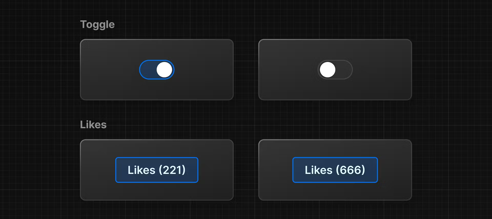

# State and Hooks

We ve build some code like this in chapter 5.

```html
<html>
  <body>
    <div id="app"></div>
    <script src="https://unpkg.com/react@18/umd/react.development.js"></script>
    <script src="https://unpkg.com/react-dom@18/umd/react-dom.development.js"></script>
    <!-- Babel Script -->
    <script src="https://unpkg.com/@babel/standalone/babel.min.js"></script>
    <script type="text/jsx">
      const app = document.getElementById("app")
      const root = ReactDOM.createRoot(app);

      // create component

      function Header() {
        return <h1>Develop. Preview. Ship.</h1>;
      }

      function HomePage() {
        const names = ['Ada Lovelace', 'Grace Hopper', 'Margaret Hamilton'];

        function handleClick() {
            console.log('increment like count');
        }

        return (
          <div>
            <Header title="Develop. Preview. Ship." />
            <ul>
              {names.map((name) => (
                <li key={name}>{name}</li>
              ))}
            </ul>
            <button onClick={handleClick}>Like</button>
          </div>
        );
      }

      // We use our compontent like HTML
      root.render(<HomePage/>);
    </script>
  </body>
</html>
```

But when you click the button, we didnt see any number change.

React has a set of functions called hooks.

Hooks allow you to add additional logic such as state to your components.

> I can make an analogy, like before i said react is like a lego brick, hook is kinda like special lego pieces that add unique features to your components. In other words you can think hooks as a special function.

> You can think of state as any DATA in your UI that CHANGES over time, usually triggered by user interaction.

Maybe you might confusing right now, but dont worry i ll explain it by some example.

You can see this image below:



Number of likes is NOT a STATIC data. so we PUT IT inside something CALLED STATE. React has some function to manage the state, that called useState().

It returns an array, and you can access and use those array values inside your component using array destructuring:

```js
function HomePage() {
  // ...
  const [] = React.useState();

  // ...
}
```

The first item in the array is the state value, which you can name anything.

```js
function HomePage() {
  // ...
  const [likes] = React.useState();

  // ...
}
```

The second item in the array is a function to update the value. You can name the update function anything, but it's common to prefix it with set followed by the name of the state variable you're updating:

```js
function HomePage() {
  // ...
  const [likes, setLikes] = React.useState();

  // ...
}
```

You can also take the opportunity to add the initial value of your likes state to 0:

```js
function HomePage() {
  // ...
  const [likes, setLikes] = React.useState(0);
}
```

Then, you can check the initial state is working by using the state variable inside your component.

```js
function HomePage() {
  // ...
  const [likes, setLikes] = React.useState(0);
  // ...

  return (
    // ...
    <button onClick={handleClick}>Like({likes})</button>
  );
}
```

Finally, you can call your state updater function, setLikes in your HomePage component, let's add it inside the handleClick() function you previously defined:

```js
function HomePage() {
  // ...
  const [likes, setLikes] = React.useState(0);

  function handleClick() {
    setLikes(likes + 1);
  }

  return (
    <div>
      {/* ... */}
      <button onClick={handleClick}>Likes ({likes})</button>
    </div>
  );
}
```

Clicking the button will now call the handleClick function, which calls the setLikes state updater function with a single argument of the current number of likes + 1.
